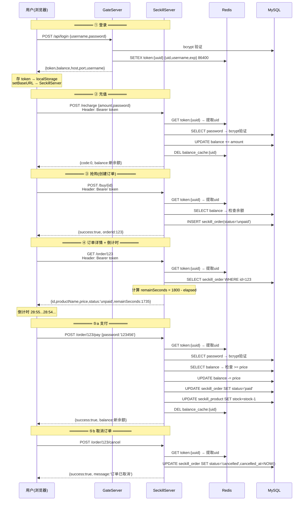
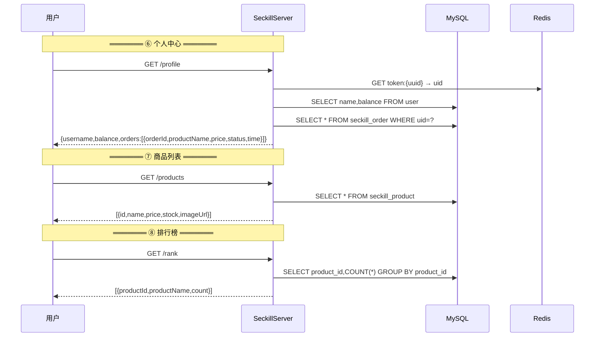
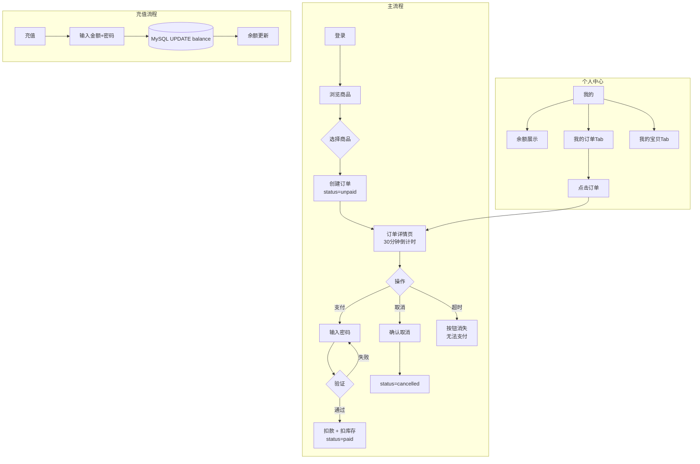

# 一、总体架构图


---

# 二、各服务架构图

## 2.1 GateServer


---

## 2.2 StatusServer


---

## 2.3 ChatServer


--- 

## 2.4 ResourceServer


---

# 三、存储层


---

# 四、核心时序

## 4.1 消息发送 + ACK


---

## 4.2 抢红包 (Redis Lua 原子操作)


---

## 4.3 通讯录匹配 + 布隆过滤器


---

## 4.4 分布式限流（令牌桶）


---

## 4.5 消息入库（批量写入 + 异步重试）


---

## 4.6 用户登录 + 服务发现


---

## 4.7 服务注册与心跳摘除


---

## 4.8 文件分片上传 + 断点续传


---

## 4.9 Client→ChatServer（一致性哈希路由 + 节点扩缩容）


---

## 4.10 ChatServer→ResourceServer（一致性哈希文件路由）


---

## 4.11 MySQL 分表（一致性哈希分片 + 扩容）


# 三、秒杀系统流程图

## API 时序图



## 个人中心 + 商品 + 排行



## 用户操作流程



## 订单状态流转

```
         ┌─── 抢购 ──→ unpaid ──┬── 支付(密码) ──→ paid
         │                      ├── 取消 ──→ cancelled
         │                      └── 30分钟超时 ──→ 无法支付(前端隐藏按钮)
```

## API 汇总

| 方法 | 路径 | 认证 | 功能 |
|---|---|---|---|
| POST | `/api/login`(GateServer) | 密码 | 登录，返回JWT |
| POST | `/recharge` | JWT+密码 | 充值 |
| GET | `/balance` | JWT | 查余额 |
| GET | `/products` | 无 | 商品列表 |
| POST | `/buy/{id}` | JWT | 创建未支付订单 |
| GET | `/order/{id}` | JWT | 订单详情+剩余时间 |
| POST | `/order/{id}/pay` | JWT+密码 | 支付(扣款+扣库存) |
| POST | `/order/{id}/cancel` | JWT | 取消订单 |
| GET | `/profile` | JWT | 个人中心(余额+订单) |
| GET | `/rank` | 无 | 排行榜 |

## 数据存储

| 数据 | 存储位置 | 说明 |
|---|---|---|
| 用户余额 | MySQL `user.balance` | 充值/购买时更新 |
| 商品库存 | MySQL `seckill_product.stock` | 支付后才扣库存 |
| 订单记录 | MySQL `seckill_order` | unpaid→paid→cancelled |
| JWT token | Redis `token:{uuid}` | TTL 24h，登录签发 |
| 余额缓存 | Redis `balance_cache:{uid}` | TTL 60s，充值/购买后清除 |
