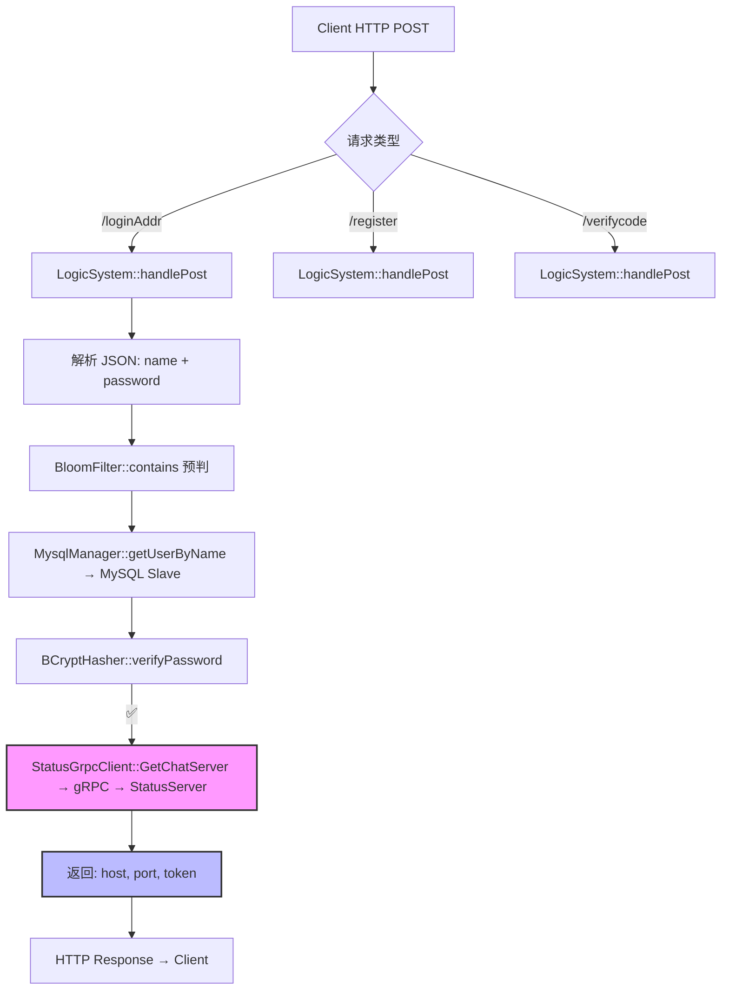

# IM 系统：请求 → 限流 → 处理 全链路流程图

## 1. GateServer（HTTP 短连接）



> GateServer **无限流**——HTTP 短连接天然限流（Nginx 连接池 + 登录频率低），登录/注册不是高频操作。

---

## 2. StatusServer（gRPC + TCP 双通道）

```mermaid
flowchart TD
    subgraph gRPC["gRPC 通道"]
        G1[GateServer gRPC请求] --> G2[StatusServiceImpl]
        G2 --> G3{"RPC 类型"}
        G3 -->|"GetChatServer"| G4[getLeastLoadedServer<br/>sessions_ + ChatServers Redis]
        G3 -->|"GetResourceServer"| G5[getLeastLoadedServer<br/>resource_sessions_ + ResourceServers Redis]
        G4 --> G6[选取 con_count 最低的 Server]
        G5 --> G6
        G6 --> G7[返回 host:port]
    end

    subgraph TCP["TCP 通道（服务注册）"]
        T1[ChatServer/ResourceServer TCP连接] --> T2[CServer::handleAccept]
        T2 --> T3[CSession::AsyncReadHead → AsyncReadBody]
        T3 --> T4[LogicSystem::registerService]
        T4 --> T5[SetServerInfo → storeInServer]
        T5 --> T6[HSET ChatServers/ResourceServers → Redis]
        T6 --> T7[返回 ID_REGISTER_RSP]
    end

    subgraph HB["心跳检测"]
        H1[每 10s 定时器] --> H2[checkChatServerConnIsOverTime]
        H1 --> H3[checkResourceSercerConnIsOverTime]
        H2 --> H4[超时 30s → Close → 踢出]
        H3 --> H4
    end

    style G6 fill:#f9f,stroke:#333,stroke-width:2px
    style T6 fill:#bbf,stroke:#333,stroke-width:2px
```



> StatusServer **无限流**——gRPC 调用频率低（仅登录时），TCP 注册仅在启动时发生一次。

---

## 3. ChatServer（TCP 长连接，核心业务）

```mermaid
flowchart TD
    subgraph ACCEPT["① 连接建立"]
        A1[Client TCP connect] --> A2[CServer::handleAccept]
        A2 --> A3[CSession::start → AsyncReadHead]
    end

    subgraph RATE["② 限流层（dealTextChatMsg）"]
        B1[收到 ID_TEXT_CHAT_MSG_REQ] --> B2["<b>L1 全局 QPS</b><br/>globalBucket_.consume()<br/>5000 msg/s"]
        B2 -->|"❌ 超限"| B2a[返回 ERROR_RATE_LIMITED<br/>\"server busy, please retry later\"]
        B2 -->|"✅ 通过"| B3["<b>L2 本地令牌桶</b><br/>userBucket_[uid].consume()<br/>10 token/s, burst=15"]
        B3 -->|"❌ 超限"| B3a[返回 ERROR_RATE_LIMITED<br/>\"发送过于频繁，请稍后重试\"]
        B3 -->|"✅ 通过"| B4["<b>L3 Redis 分布式限流</b><br/>RedisManager::checkRateLimit(uid, 10)<br/>Lua: INCR ratelimit:uid + EXPIRE 1s"]
        B4 -->|"❌ 超限"| B4a[返回 ERROR_RATE_LIMITED]
        B4 -->|"✅ 通过/Redis宕机降级放行"| B5[进入业务处理]
    end

    subgraph PROCESS["③ 业务处理"]
        C1[generateMsgId<br/>Redis INCR / Snowflake 降级]
        C1 --> C2[构造 ChatMessage]
        C2 --> C3[MessageDeduplicator::isDuplicate<br/>Redis EXISTS / MySQL UNIQUE 兜底]
        C3 -->|重复| C3a[返回缓存 ACK]
        C3 -->|新消息| C4[BatchMessageWriter::enqueue<br/>LPUSH msg:queue:pending]
        C4 --> C5["回 ACK 给发送方<br/>(message_id, unique_id, status)"]
        C5 --> C6{接收方在线?}
        C6 -->|本机| C7[CSession::Send → 直接转发]
        C6 -->|其他 ChatServer| C8[ChatGrpcClient::NotifyTextChatMsg → gRPC]
    end

    subgraph ASYNC["④ 异步写入（后台线程）"]
        D1[flushWorker: RPop msg:queue:pending] --> D2[攒批 100 条 / 100ms]
        D2 --> D3[ShardRouter: thread_id % 4]
        D3 --> D4[MysqlDao::AddChatMsg → INSERT INTO chatmessage_N]
        D4 -->|失败| D5[LPUSH batch_msg_queue_failed<br/>retry_count++]
        D5 -->|"≤ 3 次"| D6[recoveryWorker 10s 重试]
        D5 -->|"> 3 次"| D7[死信队列 batch_msg_queue_dead]
    end

    A3 --> B1

    style B2 fill:#ff6b6b,stroke:#333,stroke-width:2px
    style B3 fill:#ffa502,stroke:#333,stroke-width:2px
    style B4 fill:#ffa502,stroke:#333,stroke-width:2px
    style C4 fill:#bbf,stroke:#333,stroke-width:2px
```

> **限流三层递进**：全局 QPS（保护 Server）→ 本地令牌桶（快速、纯内存）→ Redis 分布式（跨 Server 公平）。Redis 宕机时 L3 自动放行，降级到 L1+L2。

---

## 4. ResourceServer（TCP 长连接，文件传输）


> ResourceServer **当前无限流**——文件上传天然低频（用户不频繁传文件），且单文件分片本身有间隔。

---

## 5. 全链路汇总

```
GateServer:
  HTTP POST → parse JSON → bcrypt verify → gRPC GetChatServer → Response
  [无限流 — HTTP 短连 + 低频]

StatusServer:
  gRPC: GetChatServer/GetResourceServer → getLeastLoadedServer → host:port
  TCP: 接收注册 → storeInServer → Redis HSET → 心跳 10s/超时 30s
  [无限流 — 控制面，请求量极低]

ChatServer:
  TCP → CSession → LogicSystem::dealTextChatMsg
         ├─ L1 全局 QPS 5000/s
         ├─ L2 本地令牌桶 10/s/burst15
         └─ L3 Redis 分布式 10/s
              ↓ 全部通过
         generateMsgId → isDuplicate → enqueue → ACK
              ↓ 异步
         flushWorker → ShardRouter → batch INSERT MySQL
  [三层限流 — 数据面核心，高频写]

ResourceServer:
  启动 → connectToStatusServer → ID_REGISTER_REQ → startAccept
  TCP → CSession → LogicWorker → FileWorker 写盘
  [无限流 — 文件传输低频]
```
